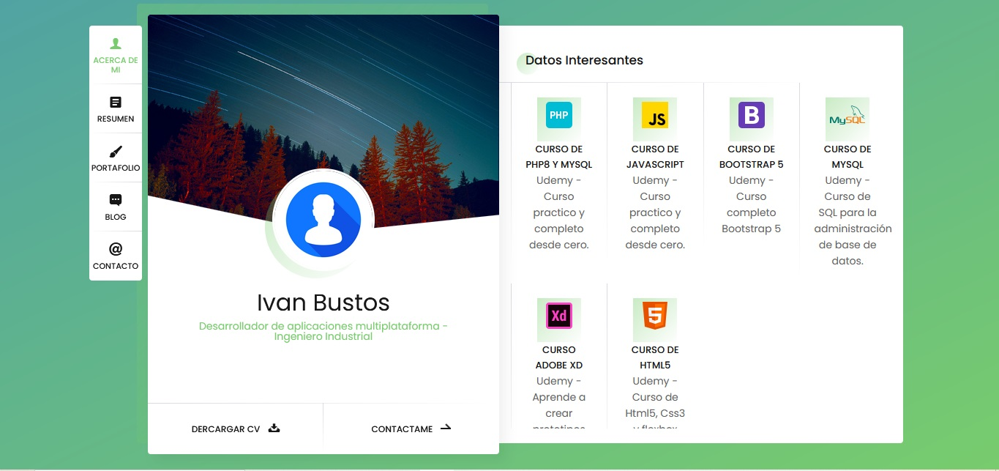

# Mi Portafolio de Desarrollo

¡Bienvenido a mi portafolio! Soy un desarrollador apasionado que crea aplicaciones modernas y eficientes. Aquí puedes explorar mis proyectos, habilidades y servicios ofrecidos.

## Sobre Mí

Soy un desarrollador de software con experiencia en el diseño y desarrollo de aplicaciones móviles, web y de escritorio. Me gusta resolver problemas mediante la tecnología y siempre busco aprender y aplicar nuevas habilidades.

## Habilidades

- **Lenguajes de Programación:**
  - JavaScript
  - Html5, Css3
  - Java
  - PHP
  - C#
  - React
  - Angular
  - Ionic

- **Frameworks y Librerías:**
  - React Native
  - ASP.NET
  - Bootstrap

- **Bases de Datos:**
  - MySQL
  - SQLite
  - Sql Server

- **Herramientas:**
  - Git
  - Visual Studio Code
  - Adobe XD

## Servicios

Ofrezco los siguientes servicios de desarrollo:

- Desarrollo de aplicaciones móviles (iOS y Android)
- Desarrollo de aplicaciones web responsivas
- Integración de APIs y servicios web
- Optimización y mantenimiento de aplicaciones
- Consultoría técnica

## Contacto

Si deseas colaborar o tienes alguna pregunta, no dudes en contactarme:

- **Email:** [tuemail@example.com](mailto:tuemail@example.com)
- **LinkedIn:** [Tu Perfil de LinkedIn](URL de tu perfil de LinkedIn)
- **GitHub:** [Tu GitHub](URL de tu GitHub)

¡Gracias por visitar mi portafolio! Espero poder colaborar contigo pronto.